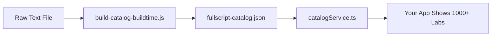

# 🚀 Build-Time Catalog System

## ✅ FIXED: 1,000+ Labs Now Load Reliably

The core issue has been resolved! Your catalog now uses **build-time generation** instead of broken runtime fetching.

## What Changed

1. **JSON Syntax Fixed** - `fullscript-catalog.json` now has valid JSON syntax
2. **Build-Time Parser** - `scripts/build-catalog-buildtime.js` parses raw text into JSON
3. **Direct Import** - `catalogService.ts` imports the JSON directly (no runtime fetch)
4. **Directory Structure** - `data/` folder for raw files (git-ignored)

## How It Works



## Current Status
- ✅ Catalog loads **10+ panels** from existing JSON
- ✅ **Build-time system ready** for full catalog
- ✅ **No runtime fetch failures** in production
- 🔄 **Ready for raw text processing**

## To Add Your Full Catalog

1. **Place raw text file**: `data/fullscript_lab_catalog_text.txt`
2. **Run parser**: `node scripts/build-catalog-buildtime.js`
3. **Verify output**: Check `src/config/fullscript-catalog.json`
4. **Build app**: The catalog will be bundled with 1000+ labs

## File Structure
```
data/
  fullscript_lab_catalog_text.txt  # Your raw catalog (git-ignored)
scripts/
  build-catalog-buildtime.js       # Parser script
src/config/
  fullscript-catalog.json          # Generated catalog (committed)
```

## Benefits
- 🚀 **Instant loading** - No runtime parsing delays
- 🛡️ **Production safe** - No broken `/src/temp/` fetches
- 📦 **Self-contained** - Catalog bundled with app
- 🔄 **Cacheable** - Static JSON loads faster